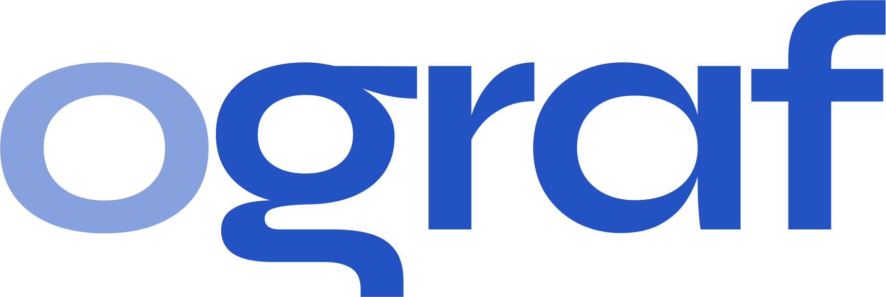

# OGraf Simple Rendering System



## What is this?

This is a web server that provides:

- An **OGraf Renderer** (a web page) to be loaded in a HTML renderer (such as CasparCG, OBS, Vmix, etc),
- An API where **OGraf Graphics** can be uploaded and managed.
- An API that can be used by a **Controller** to control the OGraf graphics.
- A simple **Controller web page** to control OGraf graphics.

## How to use

- Clone or [download this repository](https://github.com/SuperFlyTV/ograf-server/archive/refs/heads/main.zip)
- Install [Node.js](https://nodejs.org/en/download) 20 or later
- Open a console and run:

```bash
  # Prerequisite: yarn
  corepack enable

  # Install dependencies
  yarn install

  # Build libraries
  yarn build

  # Run in dev mode
  yarn dev
    # Then access the main app on http://localhost:8080
    # and the controller on http://localhost:8082

  # Run in production mode
  yarn start
    # Then access the app on http://localhost:8080

```

## Disclaimer

The control API exposed by this server is NOT stable yet, it is based on early drafts of the **OGraf Server API**.
