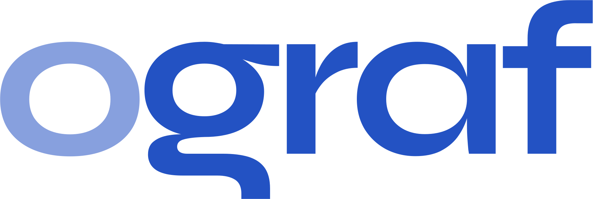

# OGraf Simple Rendering System

[](https://app.osaas.io/browse/superflytv-ograf-server)



## What is this?

This is a web server that provides:

- An **OGraf Renderer** (a web page) to be loaded in a HTML renderer (such as CasparCG, OBS, Vmix, etc),
- An API where **OGraf Graphics** can be uploaded and managed.
- An API that can be used by a **Controller** to control the OGraf graphics.
- A simple **Controller web page** to control OGraf graphics.

## How to use

- Clone or [download this repository](https://github.com/SuperFlyTV/ograf-server/archive/refs/heads/main.zip)
- Install [Node.js](https://nodejs.org/en/download)
- Open a console and run:

  ```bash
  # Install dependencies
  npm i

  # Build libraries
  npm run build

  # Run in dev mode
  npm run dev

  # Run in production mode
  npm run start
  ```

## Disclaimer

The control API exposed by this server is NOT intended to be stable.
The API is intended to eventually be replaced the upcoming (stable) **OGraf Server API**.
